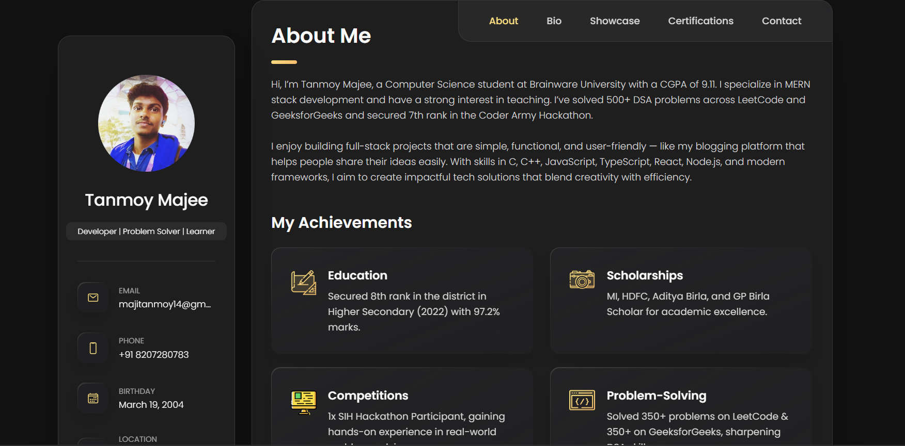
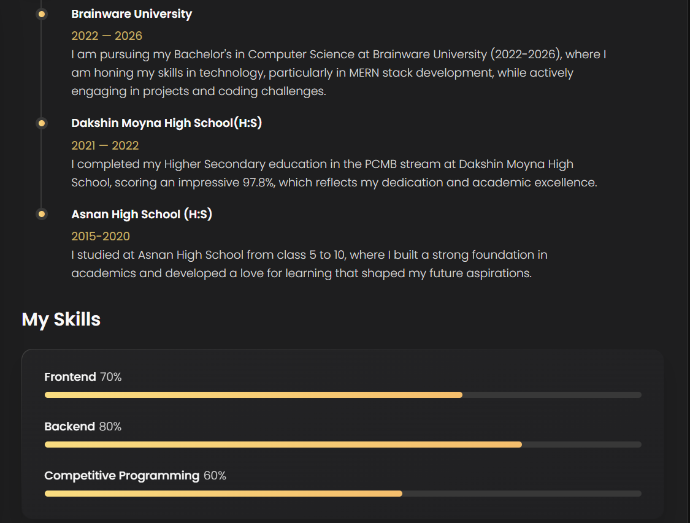
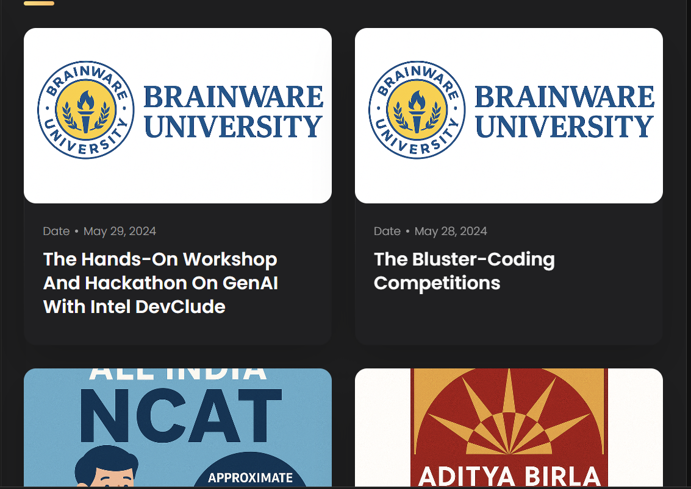
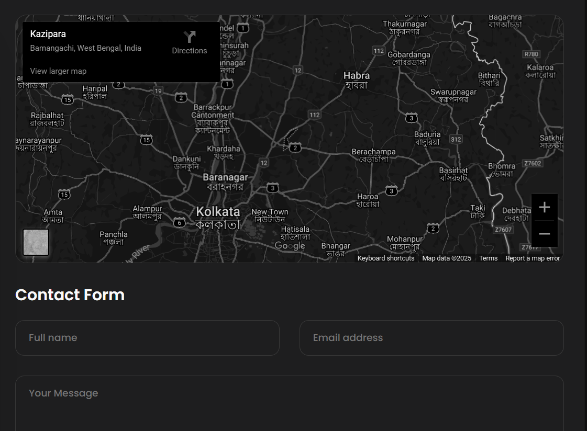

# 📘 Codeloom

[](https://github.com/tanmoy215/Code-e-Tanmoy)
[](https://tanmoy215.github.io/Code-e-Tanmoy/)
[](LICENSE)


🚀 **Codeloom** is a personal coding & portfolio project showcasing frontend development concepts, responsive UI patterns, and interactive components. It’s designed for **learning-by-building** and for presenting your work professionally.

---

## 🔗 Project Links
- **GitHub:** https://github.com/tanmoy215/Code-e-Tanmoy
- **Live:** https://tanmoy215.github.io/Code-e-Tanmoy/

---

## 📂 Overview
- Frontend with **HTML, CSS, JavaScript (Vanilla)**
- Clean, responsive UI with modular structure
- Easy deployment via **GitHub Pages**

---

## ✨ Features
- 🎨 Modern dark theme with emphasis on readability
- 🧩 Reusable components & sections (About, Skills, Projects, Blog, Contact)
- 📱 Fully responsive layout
- 🚀 One-click deployment with GitHub Pages

---

## 🛠️ Tech Stack
- **Frontend:** HTML5, CSS3, JavaScript (Vanilla)
- **Hosting:** GitHub Pages

---

## 📦 Setup
```bash
# 1) Clone
git clone https://github.com/tanmoy215/Code-e-Tanmoy.git

# 2) Open folder
cd Code-e-Tanmoy

# 3) Run locally (double-click or with a static server)
# Windows/macOS/Linux: open index.html in your browser
```

---

## 🚀 Deploy (GitHub Pages)
Push to `main` and enable GitHub Pages (root). Your site will live at:
```
https://tanmoy215.github.io/Code-e-Tanmoy/
```

---

## 📸 Screenshots
> Place the image files in your repo at: `assets/screenshots/`
>
> **Suggested filenames (rename before commit):**
> - `about-me.png` ← *Screenshot 2025-08-27 201031.png*
> - `education-skills.png` ← *Screenshot 2025-08-27 201044.png*
> - `projects-grid.png` ← *Screenshot 2025-08-27 201101.png*
> - `achievements-cards.png` ← *Screenshot 2025-08-27 201118.png*
> - `contact-map.png` ← *Screenshot 2025-08-27 201129.png*

### Gallery (Responsive)
<div align="center">
  
  
</div>

<div align="center">
  
  
</div>

<div align="center">
  
</div>

> **TIP:** HTML inside README renders on GitHub. Using `` creates a neat two-column layout on desktop and stacks on mobile.

---

## 📖 Learning Outcomes
- DOM manipulation & layout composition
- GitHub Pages workflow
- Responsive design & accessibility basics

---

## 🤝 Contributing
Suggestions are welcome! Fork the repo, create a feature branch, and open a PR.

---

## 👨‍💻 Author
**Tanmoy Majee** — Student • MERN Learner • Problem Solver

- GitHub: https://github.com/tanmoy215
- Live: https://tanmoy215.github.io/Code-e-Tanmoy/

---

## 📜 License
MIT License — see `LICENSE`.
